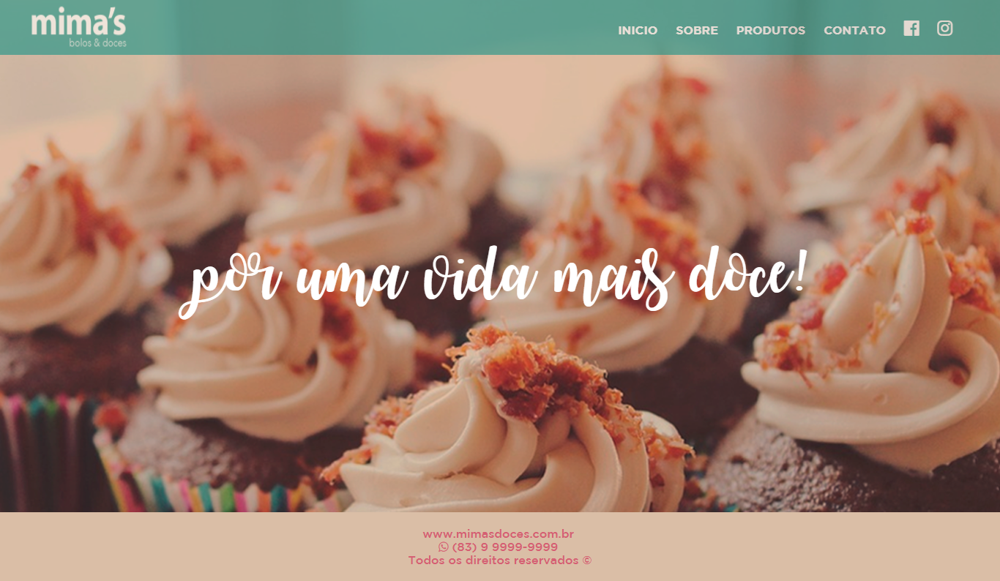
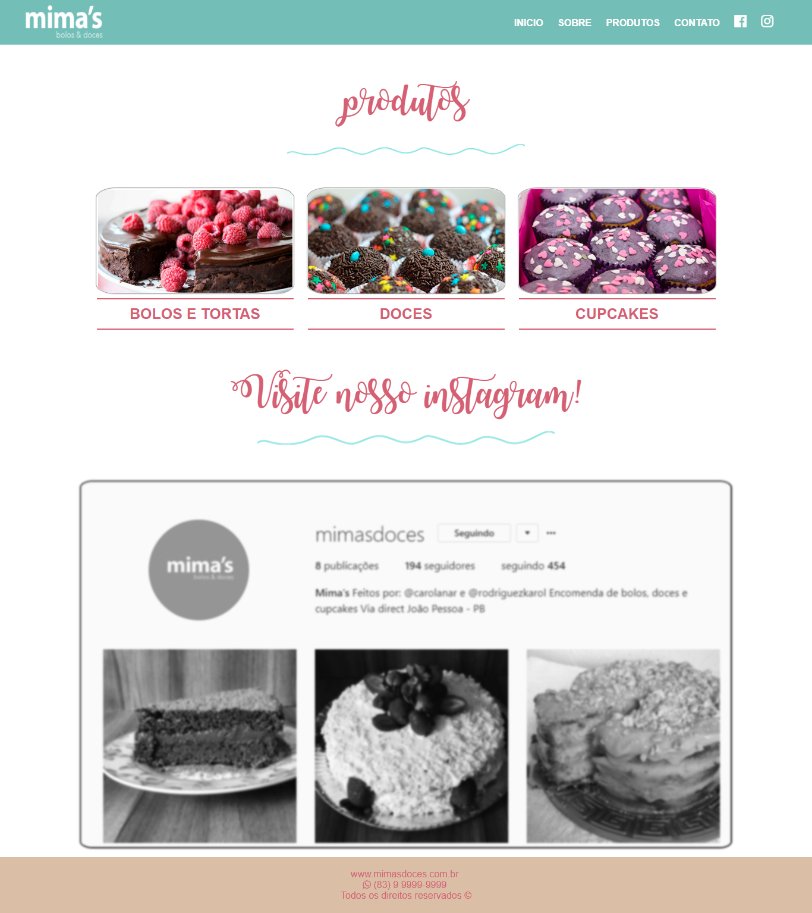

# Mima's Doces

## Descrição
Projeto da disciplina Linguagem de Marcação 2017.1

## Objetivo
O objetivo da construção desse site seria para ajudar a impulsionar uma loja de doces.

## Inspiração
Inspirações para o site:  
Sonho Doce - http://www.sonhodoce.com/
Baked by Yael - https://bakedbyyael.com/

## Protótipos

## Screenshots

<b>Página Inicial</b>

<b>P. Produtos</b>
 

<b>P. Sobre</b>
 
 
<b>P. Contato</b>
 
